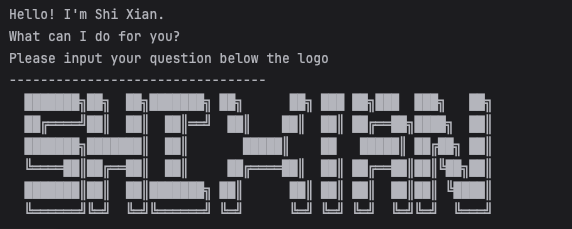

# **ShiXian Task Manager - User Guide**

## **Screenshot of the bot**

--------------------------------------------------------------------------------------------
## **Introduction**
ShiXian Task Manager is a **command-line task management application** that allows users to efficiently **track, manage, and organize tasks**. The application supports adding, marking, unmarking, deleting, and finding tasks, including different task types such as To-Dos, Deadlines, and Events.

---

## **Installation**
### **Prerequisites:**
- Java **17** must be installed on your system.

### **Steps to Run ShiXian:**
1. **Download** the `ip.jar` file from the official repository.
2. **Navigate** to the folder containing the `ip.jar` file.
3. **Run the application** using the terminal or command prompt:
   ```sh
   java -jar ip.jar
   ```
4. **You will see a welcome message along with the ShiXian logo.**

---

## **Features & Commands**

### **1. Listing All Tasks**
View all tasks in your task list.

#### **Usage:**
```sh
list
```

#### **Example Output:**
```
Here are the tasks in your list:
1. [T] [ ] Buy groceries
2. [D] [ ] Submit assignment (by: Mar 15 2024)
3. [E] [ ] Project meeting (from: 2pm to: 4pm)
```

---

### **2. Adding a To-Do Task**
Add a simple task without a deadline.

#### **Usage:**
```sh
todo <task description>
```

#### **Example:**
```sh
todo Read book
```

#### **Expected Output:**
```
Got it. I've added this task:
[T] [ ] Read book
Now you have X tasks in the list.
```

---

### **3. Adding a Deadline Task**
Add a task that must be completed by a specific date and time.

#### **Usage:**
```sh
deadline <task description> /by <date & time>
```

#### **Example:**
```sh
deadline Submit report /by 12/3/2024 1800
```

#### **Expected Output:**
```
Got it. I've added this task:
[D] [ ] Submit report (by: Mar 12 2024, 6:00 PM)
Now you have X tasks in the list.
```

---

### **4. Adding an Event Task**
Add a task that occurs within a specific time period.

#### **Usage:**
```sh
event <task description> /from <start time> /to <end time>
```

#### **Example:**
```sh
event Team meeting /from 3/12/2024 1400 /to 3/12/2024 1600
```

#### **Expected Output:**
```
Got it. I've added this task:
[E] [ ] Team meeting (from: Mar 12 2024, 2:00 PM to: 4:00 PM)
Now you have X tasks in the list.
```

---

### **5. Marking a Task as Done**
Mark a task as completed.

#### **Usage:**
```sh
mark <task number>
```

#### **Example:**
```sh
mark 2
```

#### **Expected Output:**
```
Nice! I've marked this task as done:
[D] [X] Submit assignment (by: Mar 12 2024, 6:00 PM)
```

---

### **6. Unmarking a Task**
Undo the "done" status of a task.

#### **Usage:**
```sh
unmark <task number>
```

#### **Example:**
```sh
unmark 2
```

#### **Expected Output:**
```
OK, I've marked this task as not done yet:
[D] [ ] Submit assignment (by: Mar 12 2024, 6:00 PM)
```

---

### **7. Deleting a Task**
Remove a task from the list.

#### **Usage:**
```sh
delete <task number>
```

#### **Example:**
```sh
delete 1
```

#### **Expected Output:**
```
Noted. I've removed this task:
[T] [ ] Read book
Now you have X tasks in the list.
```

---

### **8. Finding a Task**
Search for tasks that match a given keyword.

#### **Usage:**
```sh
find <keyword>
```

#### **Example:**
```sh
find assignment
```

#### **Expected Output:**
```
Here are the matching tasks in your list:
2. [D] [ ] Submit assignment (by: Mar 12 2024, 6:00 PM)
```

---

### **9. Exiting the Program**
Terminate the application.

#### **Usage:**
```sh
bye
```

#### **Expected Output:**
```
Goodbye! See you next time.
```

---

## **Error Handling**
ShiXian provides error messages for incorrect inputs:
- **Invalid command:**
  ```
  Error: Invalid command.
  ```
- **Invalid task number:**
  ```
  Error: Please enter a valid task number.
  ```
- **Invalid deadline format:**
  ```
  Error: Invalid date format! Use: d/M/yyyy HHmm (e.g., 2/12/2019 1800)
  ```

---

## **Summary of Commands**
| Command | Description | Example |
|---------|------------|---------|
| `todo` | Add a todo task | `todo Read book` |
| `deadline` | Add a task with a deadline | `deadline Submit report /by 12/3/2024 1800` |
| `event` | Add an event with start and end times | `event Team meeting /from 3/12/2024 1400 /to 3/12/2024 1600` |
| `list` | Show all tasks | `list` |
| `mark` | Mark a task as done | `mark 2` |
| `unmark` | Mark a task as not done | `unmark 2` |
| `delete` | Delete a task | `delete 1` |
| `find` | Search tasks by keyword | `find meeting` |
| `bye` | Exit the program | `bye` |

---


